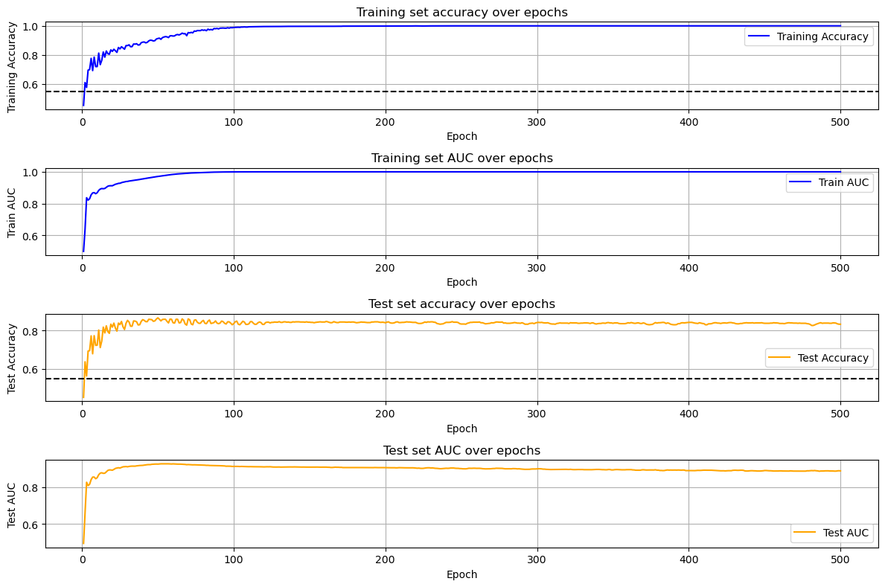
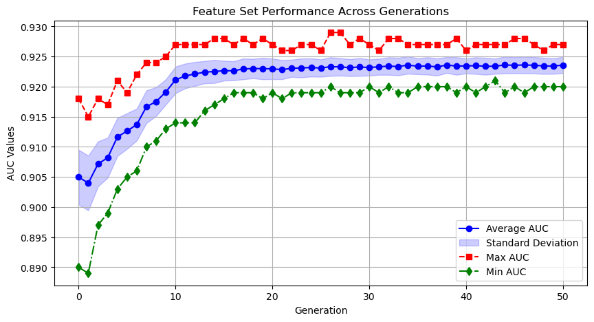
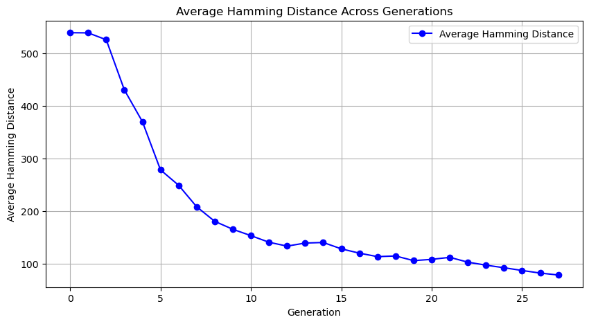
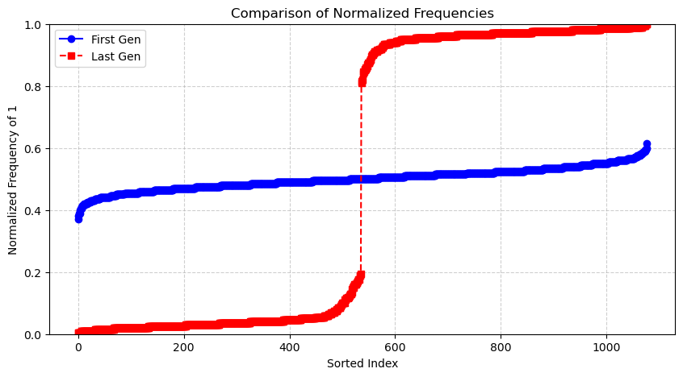

# PAGEpy - Predictive Analysis of Gene Expression in Python

## Overview
PAGEpy (Predictive Analysis of Gene Expression in Python) is compatible with both single-cell and bulk RNA sequencing datasets. It requires four input files placed in a single-cell folder:

1. A counts matrix, where genes are rows and cells or samples are columns.
2. A text file containing the list of all gene names.
3. A text file containing the list of all sample/barcode names.
4. A CSV file with the target variable of interest.

This repository provides code to format these datasets, split them into training and test groups, and select highly variable genes (HVGs) to be used as features for a neural network. The network is trained using a custom protocol aimed at minimizing overfitting and training set memorization.

Several customization options are available for different aspects of the process. Additionally, the repository includes a Particle Swarm Optimization (PSO) pipeline to improve the feature set. The PSO pipeline generates many randomized subsets of the initial set of HVGs and iteratively optimizes the population using PSO. Population members are evaluated with simplified neural network architectures over a small number of epochs. A variety of tuning parameters are provided for customization.

The end result of the PSO pipeline is a set of features, based solely on the training dataset, that could potentially improve the model’s generalizability.

The codebase also includes various plotting scripts for evaluating the model's performance.

## Table of Contents
- [Installation](#Installation)
- [Usage](#Usage)
- [Project Organization](#Project-Organization)
- [Configuration](#Configuration)
- [Contributing](#Contributing)
- [License](#License)
- [Contact](#Contact)

## Installation
1. Clone the repository:
   ```bash
   git clone https://github.com/sean-otoole/PAGEpy.git
   ```
2. Navigate to the project directory:
   ```bash
   cd your_path/PAGEpy
   ```
3. Install dependencies:
   ```bash
   pip install -r requirements.txt
   ```

## Usage
To get started, first open your script or notebook and import the necessary packages:
```python
import PAGEpy_plot
import pso
from format_data_class import FormatData
from pred_ann_model import PredAnnModel
import pickle
import pandas as pd
import PAGEpy_utils

PAGEpy_utils.init_cuda()
```
This ensures that all required packages are imported and enables GPU memory growth.

### Formatting the Data
Next, you need to format your data so it can be passed to the relevant classes and functions within the PAGEpy codebase.
```python
current_data = FormatData(data_dir = '/home/your_data_dir/',
        test_set_size=0.2,
        random_seed=1,
        hvg_count = 1000)
```
This instantiates the FormatData class, which requires a directory containing the following four files:

1. A counts matrix, where genes are rows and cells/samples are columns.
2. A text file containing the list of all gene names.
3. A text file containing the list of all sample/barcode names.
4. A CSV file with the target variable of interest.

If you're working with a sparse matrix of class `dgCMatrix` in R, you can easily produce the required file types either in R or using an R API within Python.
```R
library(Matrix)

counts <- readRDS('sparse.RNA.counts.rds')
writeMM(counts, "sparse.RNA.counts.mtx")

write.table(rownames(counts), "genes.txt", quote=FALSE, row.names=FALSE, col.names=FALSE)
write.table(colnames(counts), "barcodes.txt", quote=FALSE, row.names=FALSE, col.names=FALSE)
```

The `FormatData` class will automatically generate a list of genes for training the model, which is saved in the local directory as `hvgs.pkl`. This gene list is also available within the `FormatData` object. It’s preferred to load it from the file like this:

```python
genes_path = '/home/your_path/hvgs.pkl'

with open(genes_path, 'rb') as f:
    current_genes = pickle.load(f)
```

### Training the Model

Now, you can pass the genes list and `FormatData` object to the `PredAnnModel` class.

```Python
current_model = PredAnnModel(current_data,current_genes,num_epochs=50)
```

The model offers many customization options, but only the input data, feature list, and number of epochs are required arguments. For a complete list of optional input arguments, refer to the class docstring (e.g., `help(PredAnnModel)`). Many of these options are related to regularization techniques.

Several features make this model effective:

1. The learning rate adjusts dynamically based on performance metrics during training.
2. A percentage of the training data is hidden during each epoch to reduce overfitting and prevent memorization.
3. Target variable balancing is applied during the mini-batch training process.
4. The input layer automatically scales based on the number of features passed to the model.

Once the class is instantiated, the model will provide updates on training progress every 10 epochs. For example, here is the output after epoch 40:

```console
Epoch 40, Avg Outcome Loss: 0.3833, Train AUC: 0.9137, Train Accuracy: 0.8339, Test AUC: 0.8909, Test Accuracy: 0.8234
```
### Evaluating the Model
After training the model, you can view its progress and metrics by running:

```python
PAGEpy_plot.evaluate_model(current_model, current_data)
```

This will output:

```console
max train accuracy: 0.86
max train auc: 0.93
max test accuracy: 0.84
max test auc: 0.91
```


In this case, the model is predicting whether a cell is infected with HIV, using only the endogenous transcriptome.

### Feature Set Optimization

If you're not entirely satisfied with the model's performance, you can adjust various parameters and increase the number of epochs. You can also expand or narrow the feature set. Alternatively, you can use the Particle Swarm Optimization (PSO) algorithm included in PAGEpy to optimize the feature set.

You can execute the PSO algorithm as follows:
```python
best_solution, best_fitness = pso.binary_pso(current_genes, current_data, 200, 20)
```

The `binary_pso` function takes the current genes and splits the data into training and test sets. It randomly selects features for a specified number of population members (in this case, n=200). It then trains 200 models, each using one of the selected feature sets. The model architecture is similar to `PredAnnModel`, but with a simpler training regimen and fewer regularization elements. The models are trained for only 10 epochs. After training, the performance of each population member is used to decide whether features should be mutated. The parameters `C1` and `C2` control how individual and group performance influence these changes, while the momentum term `W` determines the likelihood of a feature change. After each generation (in this case, 20), the population members are updated. If the algorithm works well, there should be an improvement in the average and maximum test AUC values.

Since this algorithm can take a long time to run, it’s helpful to monitor its progress. The `binary_pso` function will produce two local files that you can load and use to track progress:

```python
pso_df = pd.read_pickle("pso_df.pkl")
pso_dict = pd.read_pickle("pso_dict.pkl")

PAGEpy_plot.plot_pso_row_averages(pso_df)
PAGEpy_plot.plot_hamming_distance(pso_dict)
PAGEpy_plot.plot_sorted_frequencies(pso_dict, pso_df)
```

- plot_pso_row_averages will show how the population is improving over time.


- plot_hamming_distance will track the average Hamming distance between population members, demonstrating the degree of similarity.


- plot_sorted_frequencies will show the proportional representation of features in the first and latest generations.

The output of the PSO will return the best performing feature set as well as its assocaited score. Additionally, the best performing feature set will be written within the local directory as such: `pso_genes_result.pkl`.

Subsequently, you can use the optimized feature set to then retrain the model and potentially produce an improved score with regards to the Test set AUC value as such:

```python
with open('pso_genes_result.pkl', 'wb') as f:
    pickle.dump(pso_genes, f)
      
new_model = PredAnnModel(current_data,pso_genes,num_epochs=50)
ann_plot.evaluate_model(new_model, current_data)
```

## Project Organization

```
📂 src/                           # Source code for the PAGEpy project
├── 📄 PAGEpy_plot.py                # Contains various functions for plotting the data and tracking progress
├── 📄 format_data_class.py       # The FormatData class takes expression data and a target variable to instantiate an object suitable for PSO and training a deep neural network
├── 📄 multiple_folds_class.py    # The MultipleFolds class uses the FormatData class as input to generate multiple folds (default = 5) for cross validation
├── 📄 indvidual_fold_class.py    # The IndividualFold class generates a single fold which can than be passed directly to the PredAnnModel class
├── 📄 pred_ann_model.py          # Given either the FormatData or IndividualFold the PredAnnModel class instnatiates and trains a deep neural network for target variable prediction
├── 📄 pso.py                     # Contains a series of functions for a particle swarm optimzation algoriwthm for feature selection
├── 📄 PAGEpy_utils.py              # Contains various helper functions
📂 example notebooks/             # Example python notebooks for code easy to understand exuection of the code
├── 📄 example_pipeline.ipynb     # An example notebook for running the pipeline
├── 📄 example_pso_check.ipynb    # An example notebook for checking the progress of the pipeline
📂 example_images/                # Contains example images for the readme file
📄 README.md                      # Project description and repository guide
📄 LICENSE                        # MIT license
📄 requirements.txt               # project depdencies

```

## Configuration
Explain any necessary environment variables or configuration settings.

## License
This project is licensed under the MIT License - see the [LICENSE](LICENSE) file for details.

## Contact
For any questions or suggestions, reach out to:
- **Sean O'Toole** - [sean.otoole.bio@gmail.com](mailto:your-email@example.com)
- GitHub: [sean-otoole](https://github.com/your-username)

